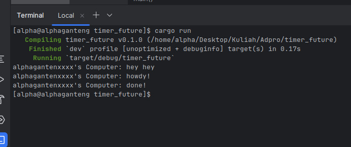

program akan melewati spawoner executer yang merupakan aisnnkronus. nah tapi tidak diprint, atau dihold karena executer belum dipnggil, lalu hey hey dieksekusi atau dicectak, setelah itu baru howdy tercetak karena spawner dieksekusi dengan eksekutor. lalu tadi kan ada timer 2 detik sebagai blcoking operation jadi tunggu dia selesai lalu print. lalu dropitu fungsinya ngomogn kalau task list nya udah habis

yang terakhir

setiap operasi di spawn (thread spawning) itu dijalankan secara asinkronus,m jadi kalau ada blocking operation dia di SKIP, INI HANYA BERLAKU SEMUA OPERASI DI DALAM SPAWNER AJA KALAU DILUAR SPAWNER INI TIDAK BERLAKU. lalu sama seperti tadi kalau ga ada drop dia ga tau kapan akan berakhir, jadi wake up terus, ini juga bisa diimplementasikan untuk use case tertentu bukan berarti sebuah bug atau ketidakgunaan